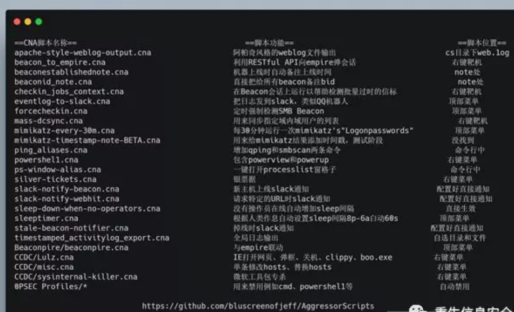

# cobaltstrike插件
- https://github.com/Und3rf10w/external_c2_framework  PY.Cobalt Strike's External C2构造CS的通讯通道。
- https://github.com/rsmudge/cortana-scripts  JAVA.用于cs2.x与armitage的可拓展插件，cvs3.x的为AggressorScripts
- https://github.com/FortyNorthSecurity/AggressorAssessor cs3.x自动化攻击脚本集合
- https://mp.weixin.qq.com/s/CEI1XYkq2PZmYsP0DRU7jg  intro.使用Aggressor脚本雕饰Cobalt Strike
- https://github.com/Ridter/CS_Chinese_support/  cs3.0传输信息的汉化插件
- https://github.com/ryhanson/ExternalC2  一个用于将通信渠道与Cobalt Strike External C2服务器集成的库
- https://github.com/threatexpress/cs2modrewrite  用于将Cobalt Strike配置文件转换为mod_rewrite脚本的工具
- https://github.com/Mr-Un1k0d3r/CatMyFish  搜索分类域，为Cobalt Strike beacon C&C设置白名单域
- https://github.com/threatexpress/malleable-c2  利用jquery文件进行C2通讯，在文件内做了JS混淆绕过防火墙
- https://github.com/phink-team/Cobaltstrike-MS17-010  cobaltstrike ms17-010（win7 x64 and win2008 r2）等插件
- https://github.com/pxss/navicatpwd  Cobalt Strike Navicate解密脚本
- https://blog.csdn.net/qq_27446553/article/details/79380021  邮件上线提醒
- https://github.com/harleyQu1nn/AggressorScripts/  脚本类型
- https://bbs.ichunqiu.com/thread-53015-1-1.html  [思路/技术] Cobaltstrike系列教程(十)安装扩展